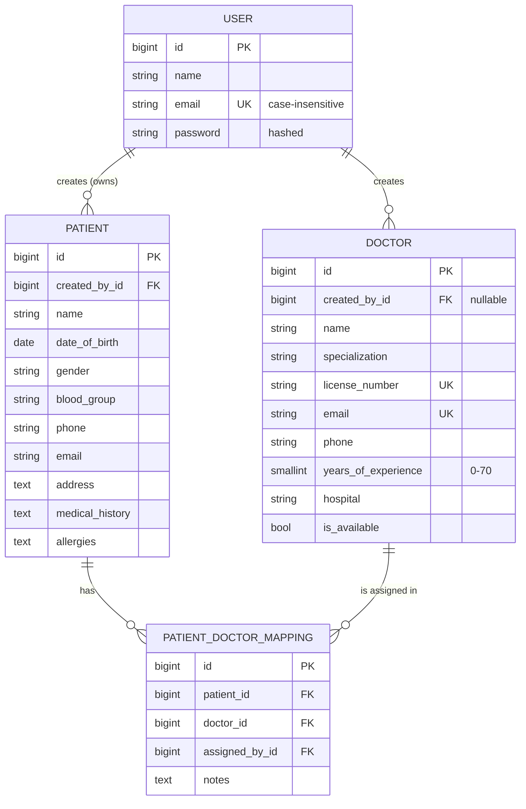

# Healthcare Backend

[](https://github.com/Sumit99589/healthcare-backend/actions/workflows/ci.yml)


A REST API for a healthcare application, built with **Django**, **Django REST Framework**
and **PostgreSQL**. Users register and log in with **JWT** (`djangorestframework-simplejwt`),
manage their own patients, maintain a shared directory of doctors, and assign doctors to
patients.

**Everything in the assignment is implemented**, plus the things a production API needs:

- **Data isolation**: a user only ever sees their own patients and mappings. Another
  user's records return `404`, so their existence is not leaked.
- **Validation everywhere**: case-insensitive unique emails, Django's password strength
  validators, phone number format, birth dates not in the future, choice fields, duplicate
  assignments (`409 Conflict`), DB-level constraints as a second line of defence.
- **One error format** for every failure (validation, auth, 404, 405, 409, 429, 500).
- **JWT done properly**: refresh-token rotation and blacklisting, a logout endpoint that
  revokes tokens, rate-limited auth endpoints.
- **Interactive API docs** (Swagger UI and ReDoc), generated from the code.
- **117 automated tests** (96% coverage) run against PostgreSQL, plus a **Postman
  collection** with 42 assertions that walks through every endpoint.
- **GitHub Actions CI** (lint, migrations check, schema validation, tests) and a
  `seed_demo` command for instant sample data.

---

## Live demo

| | |
| --- | --- |
| **Interactive console** | <https://sumit-healthcare.vercel.app> |
| API base URL | <https://sumit-healthcare-api.vercel.app/api/> |
| Swagger UI | <https://sumit-healthcare-api.vercel.app/api/docs/> |
| Health check | <https://sumit-healthcare-api.vercel.app/api/health/> |

The console is a separate frontend that calls this API straight from the browser. Start an
instant sandbox and it registers a fresh account, adds sample patients and assigns doctors.
Every request and the server's exact response are listed next to the screen as you use it.
The landing page also runs a live isolation test: two throwaway accounts try to read each
other's patients and get `404`.

The API runs on Vercel's Python runtime with a Neon PostgreSQL database
([details](#deployment)).

---

## Contents

- [Quick start](#quick-start)
- [API reference](#api-reference)
- [Examples](#examples)
- [Design decisions](#design-decisions)
- [Data model](#data-model)
- [Project structure](#project-structure)
- [Testing](#testing)
- [Configuration](#configuration)
- [Deployment](#deployment)

---

## Quick start

Requirements: Python 3.12+, PostgreSQL 15+.

```bash
git clone https://github.com/Sumit99589/healthcare-backend.git
cd healthcare-backend

python -m venv .venv
source .venv/bin/activate          # Windows: .venv\Scripts\activate
pip install -r requirements-dev.txt

# Create the database and user (adjust to match your .env)
psql -U postgres -c "CREATE USER healthcare WITH PASSWORD 'healthcare' CREATEDB;"
psql -U postgres -c "CREATE DATABASE healthcare OWNER healthcare;"

cp .env.example .env               # edit DB_* values and DJANGO_SECRET_KEY
python manage.py migrate
python manage.py seed_demo         # optional: demo user + sample data
python manage.py createsuperuser   # optional: for /admin/
python manage.py runserver
```

The API is now running at <http://localhost:8000/api/>.

### Useful URLs

| URL | What |
| --- | --- |
| <http://localhost:8000/api/docs/> | Swagger UI. Click **Authorize** and paste an access token |
| <http://localhost:8000/api/redoc/> | ReDoc reference |
| <http://localhost:8000/api/schema/> | Raw OpenAPI 3 schema |
| <http://localhost:8000/api/health/> | Health check (database connectivity) |
| <http://localhost:8000/admin/> | Django admin |

**Demo login** (after `seed_demo`): `demo@example.com` / `DemoPass!2026`

---

## API reference

All endpoints are under `/api/`. Send JSON with `Content-Type: application/json`.
Protected endpoints need `Authorization: Bearer <access token>`.

### Authentication

| Method | Endpoint | Auth | Description |
| --- | --- | --- | --- |
| `POST` | `/api/auth/register/` | No | Register with `name`, `email`, `password`. Returns the user and a JWT pair |
| `POST` | `/api/auth/login/` | No | Log in with `email`, `password`. Returns the user and a JWT pair |
| `POST` | `/api/auth/token/refresh/` | No | Exchange a refresh token for a new access + refresh token (the old one is revoked) |
| `POST` | `/api/auth/logout/` | ✅ | Revoke a refresh token |
| `GET` | `/api/auth/me/` | ✅ | The logged-in user's profile |

### Patients (private to the user who created them)

| Method | Endpoint | Description |
| --- | --- | --- |
| `POST` | `/api/patients/` | Add a patient |
| `GET` | `/api/patients/` | List **your** patients. `?search=`, `?gender=`, `?blood_group=`, `?ordering=`, `?page=`, `?page_size=` |
| `GET` | `/api/patients/<id>/` | Patient details |
| `PUT` | `/api/patients/<id>/` | Replace patient details (`PATCH` for a partial update) |
| `DELETE` | `/api/patients/<id>/` | Delete a patient (its doctor assignments go with it) |

### Doctors (shared directory)

| Method | Endpoint | Description |
| --- | --- | --- |
| `POST` | `/api/doctors/` | Add a doctor |
| `GET` | `/api/doctors/` | List all doctors. `?search=`, `?specialization=`, `?is_available=`, `?ordering=`, `?page=` |
| `GET` | `/api/doctors/<id>/` | Doctor details |
| `PUT` | `/api/doctors/<id>/` | Update a doctor (`PATCH` also supported). **Creator only** |
| `DELETE` | `/api/doctors/<id>/` | Delete a doctor. **Creator only** |

### Patient-doctor mappings

| Method | Endpoint | Description |
| --- | --- | --- |
| `POST` | `/api/mappings/` | Assign a doctor to one of your patients: `{"patient": 1, "doctor": 2, "notes": "..."}` |
| `GET` | `/api/mappings/` | All mappings for your patients. `?patient=<id>`, `?doctor=<id>` |
| `GET` | `/api/mappings/<patient_id>/` | All doctors assigned to that patient |
| `DELETE` | `/api/mappings/<id>/` | Remove a doctor from a patient (`id` is the **mapping** id) |

### Status codes

| Code | When |
| --- | --- |
| `200` / `201` / `204` | Success / created / deleted |
| `205` | Logged out |
| `400` | Validation failed: see `error.details` for every field |
| `401` | Missing, invalid or expired token; wrong credentials |
| `403` | Authenticated but not allowed (e.g. editing a doctor someone else added) |
| `404` | Not found, **or belongs to another user** |
| `405` | Method not supported on that endpoint |
| `409` | Duplicate doctor-patient assignment |
| `415` | Body is not JSON |
| `429` | Rate limit hit (auth endpoints: 10/min per IP by default) |

---

## Examples

### Register

```bash
curl -X POST http://localhost:8000/api/auth/register/ \
  -H "Content-Type: application/json" \
  -d '{"name": "Priya Nair", "email": "priya@example.com", "password": "Sunflower!Harbor42"}'
```

```json
{
  "user": { "id": 2, "name": "Priya Nair", "email": "priya@example.com", "date_joined": "2026-10-08T10:12:01.512Z" },
  "tokens": { "refresh": "eyJhbGciOi...", "access": "eyJhbGciOi..." }
}
```

### Log in and call a protected endpoint

```bash
TOKEN=$(curl -s -X POST http://localhost:8000/api/auth/login/ \
  -H "Content-Type: application/json" \
  -d '{"email": "demo@example.com", "password": "DemoPass!2026"}' | jq -r .tokens.access)

curl http://localhost:8000/api/patients/ -H "Authorization: Bearer $TOKEN"
```

### Create a patient

```bash
curl -X POST http://localhost:8000/api/patients/ \
  -H "Authorization: Bearer $TOKEN" -H "Content-Type: application/json" \
  -d '{
        "name": "Ravi Kumar",
        "date_of_birth": "1985-03-14",
        "gender": "male",
        "blood_group": "O+",
        "phone": "+91 99887 76655",
        "email": "ravi.kumar@example.com",
        "medical_history": "Hypertension since 2018.",
        "allergies": "Penicillin"
      }'
```

Required: `name`, `date_of_birth`, `gender` (`male` / `female` / `other`), `phone`.
Optional: `blood_group` (`A+`, `A-`, `B+`, `B-`, `AB+`, `AB-`, `O+`, `O-`), `email`,
`address`, `medical_history`, `allergies`. The response includes a computed `age`.

### Create a doctor

```bash
curl -X POST http://localhost:8000/api/doctors/ \
  -H "Authorization: Bearer $TOKEN" -H "Content-Type: application/json" \
  -d '{
        "name": "Dr. Meera Iyer",
        "specialization": "cardiology",
        "license_number": "MCI-10231",
        "email": "meera@hospital.example",
        "phone": "+91 98765 43210",
        "years_of_experience": 14,
        "hospital": "Apollo Hospitals"
      }'
```

`specialization` is one of `general_practice`, `cardiology`, `dermatology`,
`endocrinology`, `ent`, `gastroenterology`, `gynecology`, `nephrology`, `neurology`,
`oncology`, `ophthalmology`, `orthopedics`, `pediatrics`, `psychiatry`, `pulmonology`,
`radiology`, `urology`, `other`. A leading "Dr." is stripped from the name, emails are
lower-cased and license numbers upper-cased before the uniqueness checks.

### Doctors assigned to a patient: `GET /api/mappings/1/`

```json
{
  "patient": { "id": 1, "name": "Ravi Kumar", "date_of_birth": "1985-03-14", "gender": "male" },
  "count": 2,
  "doctors": [
    {
      "mapping_id": 1,
      "assigned_at": "2026-10-08T10:07:35.331134Z",
      "notes": "",
      "doctor": {
        "id": 1,
        "name": "Meera Iyer",
        "specialization": "cardiology",
        "specialization_display": "Cardiology",
        "license_number": "MCI-10231",
        "email": "meera@hospital.example",
        "phone": "+91 98000 00000",
        "years_of_experience": 14,
        "hospital": "Apollo Hospitals",
        "is_available": true,
        "created_by": 1,
        "created_at": "2026-10-08T10:07:35.314287Z",
        "updated_at": "2026-10-08T10:07:35.314298Z"
      }
    }
  ]
}
```

### Error format

Every error, from any endpoint, has the same shape. `message` is a readable summary and
`details` (validation errors only) lists every problem per field:

```json
{
  "error": {
    "status": 400,
    "code": "validation_error",
    "message": "date_of_birth: Date of birth cannot be in the future.",
    "details": {
      "date_of_birth": ["Date of birth cannot be in the future."],
      "gender": ["\"robot\" is not a valid choice."],
      "phone": ["Enter a valid phone number, e.g. +91 98765 43210."]
    }
  }
}
```

```json
{ "error": { "status": 409, "code": "conflict", "message": "This doctor is already assigned to this patient." } }
```

```json
{ "error": { "status": 401, "code": "token_not_valid", "message": "Given token not valid for any token type" } }
```

---

## Design decisions

**Who can see what.** Patients are personal health data, so they are scoped to the user
who created them at the queryset level (`Patient.objects.filter(created_by=request.user)`).
Asking for someone else's patient returns `404` rather than `403`, so IDs cannot be probed.
Doctors are different: the spec says `GET /api/doctors/` retrieves *all* doctors, and a
patient has to be assignable to any doctor, so doctors form a shared directory. Anyone
logged in can read it, but only the user who added a doctor (or a staff member) can
change or delete that doctor (`IsCreatorOrReadOnly`, `403` otherwise).

**Mappings follow patient ownership.** You can only assign doctors to your own patients,
and only see or remove mappings for your own patients. Assigning the same doctor twice
returns `409 Conflict`, backed by a unique constraint on `(patient, doctor)`. Doctors
marked `is_available: false` cannot take new patients. Deleting a patient or a doctor
removes their assignments.

**`/api/mappings/<id>/` means two things.** The spec uses this one URL for
`GET <patient_id>` and `DELETE <mapping id>`. Both are implemented exactly as specified
and the difference is documented in Swagger. `GET` responses include each assignment's
`mapping_id`, so a client can go straight from "doctors of this patient" to removing one.

**Authentication.** A custom `User` model logs in with email (unique, case-insensitive,
enforced in the database too) and has a single `name` field. It was in place before the
first migration, as Django recommends. Passwords go through Django's validators (length,
common passwords, all-numeric, similarity to name/email). Access tokens last 30 minutes,
refresh tokens 7 days. Refresh tokens are rotated on use and the old one is blacklisted;
`/logout/` blacklists one explicitly. Login returns the same message for an unknown email
and a wrong password, and auth endpoints are throttled to slow down brute forcing.

**Robustness.** Requests run in a transaction (`ATOMIC_REQUESTS`). Database integrity
errors from race conditions become `409` instead of `500`. Unexpected exceptions are
logged with a traceback and the client gets a generic `500` that leaks nothing.
Validation lives in serializers, with database constraints (unique, check) behind it.

**Configuration.** All secrets and environment-specific values come from environment
variables or `.env` (`django-environ`). The app refuses to start without
`DJANGO_SECRET_KEY` and `DB_PASSWORD`. With `DEBUG` off, the browsable API is disabled
and secure-cookie and proxy settings are on.

---

## Data model



Every table also has `created_at` / `updated_at` timestamps.

---

## Project structure

```
healthcare-backend/
├── config/                 # Project settings, root URLs, WSGI/ASGI
├── apps/
│   ├── common/             # Shared pieces: error handler, permissions, pagination,
│   │                       # base model, validators, health check, seed_demo command
│   ├── accounts/           # Custom User model, register / login / refresh / logout / me
│   ├── patients/           # Patient model + CRUD (owner-scoped)
│   ├── doctors/            # Doctor model + CRUD (shared directory, creator-only writes)
│   └── mappings/           # Patient-doctor assignments
│       ├── models.py
│       ├── serializers.py
│       ├── views.py
│       ├── urls.py
│       └── tests/
├── postman/                # Postman collection (+ the script that generates it)
├── conftest.py             # Shared pytest fixtures
├── .github/workflows/ci.yml
├── requirements.txt        # Runtime dependencies (pinned)
├── requirements-dev.txt    # + pytest, coverage, ruff
└── .env.example
```

Each app follows the same layout: `models` → `serializers` (validation) → `views`
(permissions, queryset scoping) → `urls`, with its tests next to it.

---

## Testing

### Automated tests

```bash
pytest                       # 117 tests against PostgreSQL
pytest --cov                 # with a coverage report (96%)
ruff check . && ruff format --check .
```

The tests cover every endpoint: the success path, validation failures, authentication
(missing, invalid and revoked tokens), cross-user isolation, permissions, duplicates,
cascades, rate limiting, the error format and admin pages. CI runs them on every push
against a real PostgreSQL service container.

### Postman

Import [`postman/Healthcare-Backend.postman_collection.json`](postman/Healthcare-Backend.postman_collection.json)
into Postman and run the collection (**Run collection**). It is a full scenario: it
registers a new user, saves the JWT into a collection variable automatically, then creates,
reads, updates, assigns and deletes records. It includes the error cases (duplicate email,
wrong password, invalid payloads, duplicate assignment, missing token, revoked token).

From the command line:

```bash
npx newman run postman/Healthcare-Backend.postman_collection.json \
  --env-var base_url=http://localhost:8000
```

```
│              requests │   28 │   0 │
│            assertions │   42 │   0 │
```

---

## Configuration

Set in `.env` (see [`.env.example`](.env.example)) or as real environment variables.

| Variable | Default | Description |
| --- | --- | --- |
| `DJANGO_SECRET_KEY` | **required** | Django secret key |
| `DJANGO_DEBUG` | `False` | Debug mode (also enables the browsable API) |
| `DJANGO_ALLOWED_HOSTS` | `localhost,127.0.0.1` | Comma-separated hosts |
| `DJANGO_CSRF_TRUSTED_ORIGINS` | empty | For the admin behind a proxy |
| `DATABASE_URL` | empty | Full PostgreSQL URL. When set it replaces the `DB_*` values below |
| `DB_NAME` / `DB_USER` | `healthcare` | PostgreSQL database / user |
| `DB_PASSWORD` | **required** | PostgreSQL password |
| `DB_HOST` / `DB_PORT` | `localhost` / `5432` | PostgreSQL location |
| `DB_CONN_MAX_AGE` | `60` | Seconds to keep a database connection open |
| `DB_DISABLE_SERVER_SIDE_CURSORS` | `False` | Set to `True` behind a transaction-mode pooler such as PgBouncer or Neon's pooled URL |
| `JWT_SIGNING_KEY` | `DJANGO_SECRET_KEY` | Key used to sign tokens |
| `JWT_ACCESS_TOKEN_MINUTES` | `30` | Access token lifetime |
| `JWT_REFRESH_TOKEN_DAYS` | `7` | Refresh token lifetime |
| `THROTTLE_AUTH` | `10/min` | Rate limit for register / login / refresh |
| `THROTTLE_ANON` / `THROTTLE_USER` | `60/min` / `600/min` | General rate limits |
| `CORS_ALLOWED_ORIGINS` | empty | Front-end origins allowed to call the API |
| `LOG_LEVEL` | `INFO` | Root log level |

---

## Deployment

The live API is deployed to [Vercel](https://vercel.com) using its built-in Django support:
Vercel finds `manage.py`, reads `WSGI_APPLICATION`, runs `collectstatic` and serves the app
as a serverless function. The database is a [Neon](https://neon.tech) PostgreSQL instance in
the same region.

Production settings are environment variables on the Vercel project, never files in the
repository:

| Variable | Production value |
| --- | --- |
| `DATABASE_URL` | Neon's pooled connection URL (added by the Neon integration) |
| `DJANGO_SECRET_KEY` | A long random string |
| `DJANGO_DEBUG` | `False` |
| `DJANGO_ALLOWED_HOSTS` | The API's domain |
| `CORS_ALLOWED_ORIGINS` | The console's origin |
| `DB_DISABLE_SERVER_SIDE_CURSORS` | `True` (Neon's pooler runs in transaction mode) |

Migrations are applied before a release with `python manage.py migrate`, pointing
`DATABASE_URL` at Neon's direct (unpooled) URL. `.vercelignore` keeps local files such as
`.env` and the virtualenv out of the upload.
